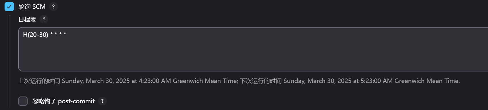

# 一、docker基础

## 1docker安装

```text
Docker用户组是在Docker安装过程中由Docker安装程序自动创建的。
在安装Docker时，通常会创建一个名为"docker"的用户组，并将当前用户添加到该用户组中，以便非root用户也能运行Docker命令。

确保您的用户已经加入了docker用户组，这样您就可以在非root用户下运行Docker命令。
如果您还没有加入docker用户组，可以使用以下命令将当前用户添加到docker组（需要管理员权限）：
```

```shell
sudo usermod -aG docker $USER
```

```text
Docker用户组是在Docker安装过程中由Docker安装程序自动创建的。
在安装Docker时，通常会创建一个名为"docker"的用户组，并将当前用户添加到该用户组中，以便非root用户也能运行Docker命令。

确保您的用户已经加入了docker用户组，这样您就可以在非root用户下运行Docker命令。
如果您还没有加入docker用户组，可以使用以下命令将当前用户添加到docker组（需要管理员权限）：
```

```shell
id
```

```shell
groups
```


### 1.**国内**安装docker
```shell
curl -sSL https://get.daocloud.io/docker | sh
```

```shell
--restart=always \ 自启动
--privileged=true \ 容器内部拥有root权限
```

### 2.阿里云镜像安装

下载新的yum源文件

```
wget -O /etc/yum.repos.d/CentOS-Base.repo http://mirrors.aliyun.com/repo/Centos-7.repo
```

**清除**yum缓存

```
yum clean all
```

**更新**yum缓存

```
yum makecache
```

测试新的yum源

```
yum list
```

使用阿里镜像，安装、更新docker

```shell
curl -fsSL https://get.docker.com | bash -s docker --mirror Aliyun
```

### 3.离线安装

#### 1.下载文件

```
https://download.docker.com/linux/static/stable/x86_64/
```

#### 2.解压

```
tar -zxvf docker-24.0.6.tgz
```

#### 3.将解压之后的`docker`文件移到 `/usr/bin`目录下;

```
sudo cp docker/* /usr/bin/
```

#### 4.将`docker`注册成系统服务;

````
vim /etc/systemd/system/docker.service
````

````
[Unit]
Description=Docker Application Container Engine
Documentation=https://docs.docker.com
After=network-online.target firewalld.service
Wants=network-online.target

[Service]
Type=notify
ExecStart=/usr/bin/dockerd
ExecReload=/bin/kill -s HUP $MAINPID
LimitNOFILE=infinity
LimitNPROC=infinity
TimeoutStartSec=0
Delegate=yes
KillMode=process
Restart=on-failure
StartLimitBurst=3
StartLimitInterval=60s

[Install]
WantedBy=multi-user.target
````

#### 5.给文件增加可执行权限

```
chmod +x /etc/systemd/system/docker.service
systemctl daemon-reload 
```

#### 6.设置开机自启动

```
systemctl enable docker.service
```

#### 7.启动`docker`

```
systemctl enable docker.service
```

### 4.使用 yum 进行安装

```
CentOS 7
```

#### （1）、 安装必要的一些系统工具

```shell
sudo yum install -y yum-utils device-mapper-persistent-data lvm2
```

#### （2）、 添加软件源信息

```shell
sudo yum-config-manager --add-repo https://mirrors.aliyun.com/docker-ce/linux/centos/docker-ce.repo
```

#### （3）、  加入镜像源地址

```shell
sudo sed -i 's+download.docker.com+mirrors.aliyun.com/docker-ce+' /etc/yum.repos.d/docker-ce.repo
```

#### （4）、  更新并安装Docker-CE

```shell
sudo yum makecache fast
sudo yum -y install docker-ce
```

#### （5）、 开启Docker服务

```shell
sudo service docker start
```

***


### 5.系统开关机命令

```
启动: systemctl start docker
停止: systemctl stop docker
重启: systemctl restart docker
查看状态: systemctl status docker
开机启动: systemctl enable docker
```

***


## 2.修改配置文件

磁盘

```shell
df -h
```


###  1修改软连接

docker存储路径

```shell
docker info | grep "Docker Root Dir"
```

停掉docker服务

```shell
systemctl stop docker
```

移动docker目录

```
mv /var/lib/docker /opt/mydata/lib
```

文件夹赋值给当前用户

```shell
sudo chown $USER:$USER  docker/
```

如容器在运行中可使用docker network connect 网络名 容器名加入到同一网络
```docker
docker network connect 网络名 容器名
```


- /opt/mydata/lib/docker，也就是新设置的docker存储目录
- /var/lib/docker为软链接目标目录，与此目录建立链接后，相当于原来的docker配置保持不变，但真正的存储目录是其背后所指向的/opt/mydata/docker

```shell
ln -s /opt/mydata/lib/docker /var/lib/docker
```

查看/var/lib/目录，docker目录是一个软链接，指向/opt/mydata/docker，配置正确

```shell
ls -al /var/lib
```

```shell
ll /var/lib/docker
```


### 2   配置文件
当前用户添加到docker组中

```
sudo usermod -aG docker $USER
```

文件夹赋值给当前用户

```shell
sudo chown $USER:$USER  /opt/lib
```

```shell
mv /var/lib/docker /opt/lib
```

没有文件，就新建一个

```shell
vim /etc/docker/daemon.json
```

### 3.配置内容(镜像)

```json
{
    "builder": {
        "gc": {
            "defaultKeepStorage": "20GB",
            "enabled": true
        }
    },
    "experimental": false,
    "data-root": "/opt/lib/docker",
    "registry-mirrors": [
        "https://docker.1ms.run",
        "https://doublezonline.cloud",
        "https://dislabaiot.xyz",
        "https://docker.fxxk.dedyn.io",
        "https://dockerpull.org",
        "https://docker.unsee.tech",
        "https://hub.rat.dev",
        "https://docker.1panel.live",
        "https://docker.nastool.de",
        "https://docker.zhai.cm",
        "https://docker.5z5f.com",
        "https://a.ussh.net",
        "https://docker.udayun.com",
        "https://hub.geekery.cn"
    ]
}
```

```json
{
    "builder": {
        "gc": {
            "defaultKeepStorage": "20GB",
            "enabled": true
        }
    },
    "experimental": false,
    "registry-mirrors": [
        "https://docker.1ms.run"
        "https://hub.rat.dev",
        "https://docker.nju.edu.cn",
        "http://hub-mirror.c.163.com",
        "https://docker.mirrors.ustc.edu.cn",
        "https://docker.1panel.live",
        "https://docker.m.daocloud.io",
        "https://registry.docker-cn.com",
        "https://docker.nju.edu.cn",
        "http://hub-mirror.c.163.com",
        "https://docker.mirrors.ustc.edu.cn",
        "https://docker.1panel.live",
        "https://docker.m.daocloud.io",
        "https://registry.docker-cn.com"
    ]
}
```


启动docker服务

```shell
sudo systemctl start docker
```

```
sudo systemctl restart docker
```

***

## 4.镜像命令

### 1.docker命令

```
查看概要: docker info
查看本地镜像: docker images
拉取镜像: docker pull
查看存储: docker system df
强制删除镜像: docker rmi -f
查看已下载的Docker镜像latest具体版本
docker image inspect (docker image名称):latest|grep -i version
导出镜像: docker save -o test.tar mysql:8.0.28
导入镜像: docker load -i test.tar
docker tag 标签
cup 内存等信息 docker stats
```

### 2.无法删除镜像

```
cd /var/lib/docker/image/overlay2/imagedb/content/sha256
```

```
rm -rf 文件名(输入docker images 查询到的简称,tab出全程)
```

### 3.镜像导出导入

-- out

```
docker save -o myimage.tar myimage
```

批量

```
docker save -o images.tar image1:tag1 image2:tag2
```


所有镜像

```
docker save -o all_images.tar $(docker images -aq)
```


-- input

```
docker load -i <image_file.tar>
```

或者

```
docker save nginx > Nginx.tar
```

Windows不识别

```
docker load < Nginx.tar
```

---


## 5.容器命令

```
启动交互式容器(前台命令行)

查看运行的容器: docker ps 
显示所有的容器，包括未运行的: docker ps -a
    停止后无法查看,要查看需要运行的,可以用 docker images 查找容器id 也可以用 docker ps -n 2 最近使用的
查看已经停止的: docker ps -n 2
进入容器: docker exec -it 容器id /bin/bash

退出
容器关闭:   exit 
容器不停止:  ctrl+p+q 

启动已经停止的容器id: docker start 容器id
重启容器: docker restart 容器id
停止容器: docker stop 容器id
强制停止容器: docker kill 容器id
删除已停止容器: docker rm

开机启动 docker update --restart=always  xx
```

### 2.容器复制文件到宿主机

```
docker cp 容器名:容器内路径 目的主机路径 
```

### 3.日志

后台运行查询指定数量最新log

```
docker logs -f -t --tail=5 容器名
```

### 4.创建完成的容器修改启动参数

```
docker container update restart=always 容器名或id
```

### 5.查看容器启动参数

```
runlike 容器
```

### 6.容器导出导入

```
docker export b91d9ad83efa > tomcat80824.tar
```

```
docker import tomcat80824.tar
```

***

## 6.制作镜像

### 1.java

Dockerfile

```
FROM eclipse-temurin:17-jre-alpine

VOLUME /tmp

#RUN cd /
# eclipse-temurin:17-jre-alpine 没有mkdir命令
#RUN bash -c 'mkdir -p {config,target}'
COPY /target/*.jar /server.jar

# 自动识别config/application.yml
ENTRYPOINT ["java","-jar","/server.jar"]

#配置时区，不然会发现打包到docker中启动的容器日志里的时间是差8个小时的
RUN /bin/cp /usr/share/zoneinfo/Asia/Shanghai /etc/localtime \
&& echo 'Asia/Shanghai' >/etc/timezone \

# docker 命令 对应的idea运行配置
# restart=always; privileged=true;
# idea运行配置
# --restart=always --privileged=true

# 暴露端口,需要和服务的端口一致
EXPOSE 11090

```

### 2. nginx

Dockerfile

```
FROM nginx:1.23.2-alpine

# 删除nginx 默认配置
RUN rm /etc/nginx/conf.d/default.conf
# 添加我们自己的配置 default.conf 在下面
ADD docker/default.conf /etc/nginx/conf.d/
# 把刚才生成dist文件夹下的文件copy到nginx下面去
COPY dist/  /usr/share/nginx/html/

# --restart=always --privileged=true
EXPOSE 80

```

nginx的配置文件 default.conf

```
server {
    listen       80;
    listen  [::]:80;
    server_name  localhost;

    #access_log  /var/log/nginx/host.access.log  main;

    location / {
        root   /usr/share/nginx/html;
        index  index.html index.htm;
    }

    location  ^~ /baseApi/ {
        proxy_pass   http://192.168.101.143:12701/;
    }
  location  ^~ /gatewayApi/ {
        proxy_pass   http://192.168.101.134:30011/;
    }


    #error_page  404              /404.html;

    # redirect server error pages to the static page /50x.html
    #
    error_page   500 502 503 504  /50x.html;
    location = /50x.html {
        root   /usr/share/nginx/html;
    }

    # proxy the PHP scripts to Apache listening on 127.0.0.1:80
    #
    #location ~ \.php$ {
    #    proxy_pass   http://127.0.0.1;
    #}

    # pass the PHP scripts to FastCGI server listening on 127.0.0.1:9000
    #
    #location ~ \.php$ {
    #    root           html;
    #    fastcgi_pass   127.0.0.1:9000;
    #    fastcgi_index  index.php;
    #    fastcgi_param  SCRIPT_FILENAME  /scripts$fastcgi_script_name;
    #    include        fastcgi_params;
    #}

    # deny access to .htaccess files, if Apache's document root
    # concurs with nginx's one
    #
    #location ~ /\.ht {
    #    deny  all;
    #}
}

```

## 7.网关networks

### 1.创建网络

```
私有网络3个波段
可以选择的网段范围： 根据 RFC 1918，私有 IP 网段包括：

10.0.0.0/8：支持大量地址，适用于大型网络。
172.16.0.0/12：适合中型网络。
192.168.0.0/16：适合小型网络或家庭网络。
```

```
10.0.0.0/8 ,子网掩码：8 表示前 8 位固定（255.0.0.0） ,总地址数：16,777,216
```

```
10.0.1.0/24,子网掩码：24 表示前 24 位固定（255.255.255.0）,总地址数：256
```


```
网络范围,和网关ip
```

```
docker network create --subnet=172.18.0.0/16  mynetwork
```

### 2.容器固定ip

```
docker run -d --name=my_container --net=mynetwork --ip=172.19.0.22 <image_name>
```

```dockerfile
services:
  my_service:
    image: my_image
    networks:
      my_network:
        ipv4_address: 172.18.0.22
networks:
  my_network:
    driver: bridge
    ipam:
      config:
        - subnet: 172.18.0.0/16

```

### 3.现有容器加入网关

```
docker network connect mynetwork my_container
```

## 8.yum管理docker

###  1.只搜索可安装的版本（不包括已安装的）

```
yum --showduplicates list docker-ce available | sort -r
```

### 2.搜索所有可用版本（包括已安装和可用的）

```
yum list docker-ce --showduplicates | sort -r
```

### 3.yum更新docker

```
sudo yum update docker-ce docker-ce-cli containerd.io
```

```
bash <(curl -sSL https://linuxmirrors.cn/docker.sh)
```


# 二、docker常用容器

## 本教程网关  (mynetwork)

```
--net=mynetwork --ip=172.19.0.22
```


## portainer-ce 图形界面

### 命令

```
docker pull portainer/portainer-ce:2.21.3
```


```
mkdir -p /opt/mydata/portainer/data
```

```
/var/run/docker.sock:/var/run/docker.sock 是固定值,docker的内容
```

```
docker run -d  --name portainer -p 18001:9000 -v /var/run/docker.sock:/var/run/docker.sock -v /opt/mydata/portainer/data:/data --restart always --privileged=true portainer/portainer-ce:2.21.3
```

```
admin
abcd1234567890
```

## 外挂一个jar

不能使用通配符

```
docker run -d -p 13010:8080 --name demo1 -v /opt/app/demo1/app.jar:/app.jar eclipse-temurin:17-jre-jammy java -jar app.jar 
```

```
#!/bin/bash

# 定义 JAR 文件目录
JAR_DIR="/opt/app/demo1"

# 按版本号或时间排序，选择最新文件
LATEST_JAR=$(ls -t "$JAR_DIR"/demo-*.jar | head -n1)

# 创建符号链接
ln -sf "$LATEST_JAR" "$JAR_DIR/latest.jar"

# 验证链接
ls -l "$JAR_DIR/latest.jar"
```

```
# 验证链接
ls -l "$JAR_DIR/latest.jar"
# 挂载符号链接
docker run -d -p 13010:8080 --name demo1 \
  -v /opt/app/demo1/latest.jar:/app.jar \
  eclipse-temurin:17-jre-jammy java -jar app.jar
```


## mysql

### 1.命令

必须有时区，不然部分应用区分时区的，会链接不上

```
mkdir -p /opt/mydata/mysql8/{data,logs,conf}
```

## 复制配置文件,一行命令

```
docker run --rm mysql:8.0.43 cat /etc/my.cnf > /opt/mydata/mysql8/conf/my.cnf
```

```
docker run \
--name mysql8 -d \
-p 3306:3306 \
-e MYSQL_ROOT_PASSWORD=123456 \
mysql:8.0.43
```

```
docker cp mysql8:/etc/my.cnf /opt/mydata/mysql8/conf/my.cnf
docker cp mysql8:/etc/conf.d /opt/mydata/mysql8/conf.d
```

```
docker stop mysql8
```

```
docker rm mysql8
```

```
--restart=always 
```


```
docker run \
--name mysql8 -d \
-p 3306:3306 \
-e MYSQL_ROOT_PASSWORD=123456 \
--restart=unless-stopped \
--net=mynetwork \
-e TZ=Asia/Shanghai \
-v /opt/mydata/mysql8/conf/my.cnf:/etc/my.cnf \
-v /opt/mydata/mysql8/data:/var/lib/mysql \
mysql:8.0.43
```

### 2.Windows安装

```
docker run --name mysql8 -d -p 3306:3306 -e MYSQL_ROOT_PASSWORD=123456  --net=mynetwork -v D:\opt\mydata\mysql8\data:/var/lib/mysql mysql:8.0.43
```


```
docker exec -it mysql bash
```

```
mysql -u root -p
ALTER USER 'root'@'localhost' IDENTIFIED BY 'root!';
```

### 3.配置文件 my.cnf

```
[mysqld]
pid-file        = /var/run/mysqld/mysqld.pid
socket          = /var/run/mysqld/mysqld.sock
datadir         = /var/lib/mysql
secure-file-priv= NULL
# Disabling symbolic-links is recommended to prevent assorted security risks
symbolic-links=0

# Custom config should go here
!includedir /etc/mysql/conf.d/


# 设置mysql客户端默认字符集
default-character-set=utf8
[client]
# 设置mysql客户端连接服务端时默认使用的端口
port=3306
default-character-set=utf8
```

### 4.Navicat链接问题

```
docker exec -it mysql8 /bin/bash
mysql -u root -p
use mysql;
update user set host = '%' where user ='root';
select user,host from user where user = 'root';
flush privileges;
```

## postgres

### 命令

```
docker run --name demo-pgsql  -d \
-e POSTGRES_PASSWORD=123456 \
-p 5432:5432 \
-v /opt/mydata/postgresql/data:/var/lib/postgresql/data \
postgres:14.6-alpine
```

### 修改连接

```
docker exec -it demo-pgsql bash
```

```
psql -h localhost -p 5432 -U postgres --password
```

## SQL Server

#### docker compose 


```
version: '3.1'
services:
  sqlserver-2022:
    restart: always
    container_name: sqlserver-2022
    image: mcr.microsoft.com/mssql/server:2022-latest
    #端口映射
    ports:
      - 1433:1433
    volumes:
      - /opt/mydata/mssql/data:/var/opt/mssql/data
    #环境变量
    environment:
      - ACCEPT_EULA=Y
      #SA用户密码长度必须至少为 8 个字符，并包含以下四组中的三组字符：大写字母、小写字母、10 位基数和符号
      - SA_PASSWORD=Abcd!1234
```

#### Windows

```
docker run -e "ACCEPT_EULA=Y" -e "MSSQL_SA_PASSWORD=Abcd!1234" -p 1433:1433 --name mssql-2019 --hostname mssql-2019 -v D:\home\mssql\data:/var/opt/mssql/data -d mcr.microsoft.com/mssql/server:2019-latest
```


## nacos

### 1. 低版本(1.4.x)

```
docker run --name nacos -d \
-e MODE=standalone \
-p 8848:8848 \
--restart=always \
nacos/nacos-server:1.4.2
```


```
挂载的文是/opt/mydata/nacos/init.d/custom.properties
```

```
docker pull nacos/nacos-server:1.4.0

mkdir -p /opt/mydata/nacos1/{init.d,conf}

docker run --name nacos -d \
-e MODE=standalone \
-p 8848:8848 \
--restart=always \
-v /opt/mydata/nacos/logs:/opt/mydata/nacos/logs \
-v /opt/mydata/nacos/init/custom.properties:/opt/mydata/nacos/init.d/custom.properties \
nacos/nacos-server:1.4.0
```

### 2. 1.4.2 及 2.0.3版本

```
mkdir -p /opt/mydata/nacos/{logs,conf}
```

````
修改内存大小
-e JVM_XMS=128m \
-e JVM_XMX=128m \
-e JVM_XMN=64m \
````

```
挂载的文件是/opt/mydata/nacos/conf/application.properties
```

##### 复制配置文件

```
docker  run \
--name nacos -d \
-p 8848:8848 \
-p 9848:9848 \
-e JVM_XMS=128m \
-e JVM_XMX=128m \
-e JVM_XMN=64m \
nacos/nacos-server:v2.2.0
```

```
docker cp nacos:/opt/mydata/nacos/conf/application.properties /opt/mydata/nacos/conf/application.properties
```

```
docker stop nacos 
docker rm nacos
```

```
docker  run \
--name nacos -d \
-p 8848:8848 \
-p 9848:9848 \
--privileged=true \
--restart=always \
-e MODE=standalone \
-e JVM_XMS=256m \
-e JVM_XMX=256m \
-e JVM_XMN=256m \
-v /opt/mydata/nacos/logs:/opt/mydata/nacos/logs \
-v /opt/mydata/nacos/conf/application.properties:/opt/mydata/nacos/conf/application.properties \
nacos/nacos-server:v2.2.1
```

```dockerfile
docker run -d \
--restart=always \
--name nacos \
-e MODE=standalone \
-e JVM_XMS=256m \
-e JVM_XMX=256m \
-e JVM_XMN=256m \
-p 8848:8848 \
-p 9848:9848 \
-v /usr/local/docker/nacos/config/application.properties:/home/nacos/conf/application.properties \
nacos/nacos-server:v2.4.3
```


### 3.Windows安装

```dockerfile
使用docker compose
```

### 4.持久化SQL,注意版本

```
https://github.com/alibaba/nacos/blob/2.0.4/distribution/conf/nacos-mysql.sql
```
```
https://github.com/alibaba/nacos/blob/2.2.0/distribution/conf/mysql-schema.sql
```


### 5 docker compose 

#### 连接mysql用内部ip,也可以用宿主机ip

```shell
见docker compose
```

```
spring.datasource.platform=mysql
db.num=1
db.url.0=jdbc:mysql://172.18.0.2:3306/nacos
db.user=root
db.password=123456
```

```
在 Docker Compose 中，subnet 字段用于设置 IP 地址范围的子网掩码。子网掩码决定了 IP 地址范围的大小。当你设置了 subnet 为 172.18.1.0/16 时，实际上是将 IP 地址范围划分为一个 /16 的子网，而不是指定特定的 IP 范围。

正常情况下，一个 /16 子网可以包含约 65536 个 IP 地址。所以，如果你设置了 subnet: 172.18.1.0/16，它实际上会涵盖从 172.18.0.0 到 172.18.255.255 的所有 IP 地址
```


## seata

### 命令

```
docker pull seataio/seata-server:1.4.2
```

```
docker run --name demo-seata -d \
-p 8091:8091 \
--privileged=true \
--restart=always \
-e SEATA_PORT=8091 \
seataio/seata-server:1.4.2
```

```
docker cp demo-seata:/seata-server/resources/registry.conf /root/mydata/seata/resources/registry.conf
docker cp demo-seata:/seata-server/resources/file.conf /root/mydata/seata/resources/file.conf
```

```
docker stop demo-seata
```

```
docker rm demo-seata
```

```
 ## 指定ip地址，NettyClientChannelManager可通过外网ip访问
```

```
docker run --name seata -d \
-p 8091:8091 \
--privileged=true \
--restart=always \
-e SEATA_PORT=8091 \
-v /opt/mydata/seata/resources/registry.conf:/seata-server/resources/registry.conf \
-v /opt/mydata/seata/resources/file.conf:/seata-server/resources/file.conf \
-v /opt/mydata/seata/logs:/root/logs \
-e SEATA_IP=192.168.101.143 \
seataio/seata-server:1.4.2
```

### 持久化SQL

```
新版本 seata+nacos 需要在nacos导入配置文件,官网执行sh脚本
https://github.com/seata/seata/blob/develop/script/server/db/mysql.sql
```

## redis

### 1.建立挂载目录

```
mkdir -p /opt/mydata/redis/conf
chmod -R 777 /opt/mydata/redis
```

```
没有配置文件这件事呢！那是因为redis容器里边的配置文件是需要在创建容器时映射进来的
https://github.com/redis/redis/blob/unstable/redis.conf 
下载文件,进行映射
```

```
docker exec -it redis7 sh
```

### 2.命令

```
docker run --name redis7 -d \
-p 6379:6379 \
--privileged=true \
--restart=always \
-v /opt/mydata/redis/redis.conf:/etc/redis/redis.conf \
-v /opt/mydata/redis/data:/data \
redis:7.0.4 redis-server /etc/redis/redis.conf
```

### 3.Windows安装

```
docker run --name redis7 -d -p 6379:6379 --net=mynetwork --ip=172.19.0.6 -v D:\home\redis\data:/data redis:7.0.4 redis-server
```


## nginx

### 建立挂载目录

```
mkdir -p /opt/mydata/nginx/{conf,conf.d,html,log}

docker run --name demo-nginx -p 8080:80 -d nginx:1.23
docker cp demo-nginx:/etc/nginx/nginx.conf /opt/mydata/nginx/conf/nginx.conf

docker cp demo-nginx:/etc/nginx/conf.d/default.conf /opt/mydata/nginx/conf.d/default.conf
```

### 命令

```
docker run --name demo-nginx -d \
-p 3500:80 \
--restart always\
-v /opt/mydata/nginx/html:/usr/share/nginx/html \
-v /opt/mydata/nginx/conf/nginx.conf:/etc/nginx/nginx.conf \
-v /opt/mydata/nginx/conf.d/default.conf:/etc/nginx/conf.d/default.conf \
-v /opt/mydata/nginx/log:/var/log/nginx \
nginx:1.23
```

```
配置请求转发,在conf.d/default.conf 中配置
```

## mongodb

### 文件夹

```
mkdir -p /opt/mydata/mongodb/{data,conf,backup}
```

### mongodb.conf

```
# mongodb.conf
logappend=true
# 被远程
# bind_ip=127.0.0.1
port=27017 
fork=true
noprealloc=true
auth=true
```

### 命令

```
docker run --name mongodb -d \
-p 27017:27017 \
--privileged=true \
--restart=always \
-e TZ=Asia/Shanghai \
-e MONGO_INITDB_ROOT_USERNAME=admin \
-e MONGO_INITDB_ROOT_PASSWORD=admin123 \
-v /opt/mydata/mongodb/data:/data/db \
-v /opt/mydata/mongodb/backup:/data/backup \
-v /opt/mydata/mongodb/conf:/data/configdb \
mongo:4.4.13-focal
```

### 创建新的账号密码

```
docker exec -it mongodb mongo admin
```

```
db.createUser({user:'root',pwd:'123456',roles:['userAdminAnyDatabase']});
```

数据导出,在内部位置,然后cp

```
docker exec -it mongodb mongodump --username=cepai --password=123456 --out=/data/backup
```

数据导入,cp到容器内部

```
docker exec -it mongodb mongorestore --username=admin --password=yourpassword /data/backup
```

***


## minio

### Linux 命令

```
docker run -p 19000:9000 -p 19001:9001 --name minio \
-d --restart=always \
--privileged=true \
-e TZ="Asia/Shanghai" \
-e MINIO_ROOT_USER=admin \
-e MINIO_ROOT_PASSWORD=admin123 \
minio/minio:RELEASE.2024-10-02T17-50-41Z server /data --console-address ":9001"
```

```
mkdir -p /opt/mydata/minio/{data,conf}
```

```
docker cp minio:/root/.minio /opt/mydata/minio/conf 
```

```
docker cp minio:/data /opt/mydata/minio/data 
```

```
docker run -p 19000:9000 -p 19001:9001 --name minio \
-d --restart=always \
--privileged=true \
--net=mynetwork \
-e TZ="Asia/Shanghai" \
-e MINIO_ROOT_USER=admin \
-e MINIO_ROOT_PASSWORD=admin123 \
-v /opt/mydata/minio/data:/data \
minio/minio:RELEASE.2024-10-02T17-50-41Z server /data --console-address ":9001"
```

### Windows命令

```
docker run -d -p 19000:9000 -p 19001:9001 --name minio -e "MINIO_ROOT_USER=admin" -e "MINIO_ROOT_PASSWORD=12345678" --net=mynetwork --ip=172.19.0.11 -v D:\home\minio/data:/data -v D:\home\minio/conf:/root/.minio minio/minio:RELEASE.2024-07-16T23-46-41Z server /data --console-address ":9001"
```

```
docker cp minio:/root/.minio D:\home\minio/conf 
```

```
docker cp minio:/data D:\home\minio
```

***


## keycloak

### 命令

```
docker run --name keycloak -d -p 16201:8080 -e KEYCLOAK_USER=admin -e KEYCLOAK_PASSWORD=admin keycloak/keycloak:25.0 start-dev
```

```
mkdir -p /opt/mydata/keycloak/{data,logs,conf}
```

```
docker cp keycloak:/opt/keycloak/conf/keycloak.conf /opt/mydata/keycloak/conf/keycloak.conf
```

```
docker run --name keycloak -d \
-p 16201:8080 \
-e KEYCLOAK_USER=admin \
-e KEYCLOAK_PASSWORD=admin \
--restart=always \
--net=mynetwork \
-v /opt/keycloak/conf/keycloak.conf:/opt/mydata/keycloak/conf/keycloak.conf \
keycloak/keycloak:25.0 start-dev
```


### 禁用https

```
docker exec -it keycloak bash
```

```
cd /opt/jboss/keycloak/bin  # 在opt里面,每个版本不一样,
```

```
./kcadm.sh config credentials --server http://localhost:8080/auth --realm master --user admin 
```

```
./kcadm.sh update realms/master -s sslRequired=NONE
```

## rabbitmq

#### 命令

```
docker run --name rabbitmq -d \
--privileged=true \
--restart=always \
-d -p 5672:5672 -p 15672:15672 \
-v /opt/mydata/rabbitmq/data:/var/lib/rabbitmq \
-v /opt/mydata/rabbitmq/conf:/etc/rabbitmq \
-v /opt/mydata/rabbitmq/log:/var/log/rabbitmq \
--hostname=rabbitmqhost \
-e RABBITMQ_DEFAULT_VHOST=my_vhost \
-e RABBITMQ_DEFAULT_USER=admin \
-e RABBITMQ_DEFAULT_PASS=123456 \
rabbitmq:3.9.20-management-alpine
```

### 进入bin开启管理页面

```
docker exec -it rabbitmq /bin/bash
```

```
rabbitmq-plugins enable rabbitmq_management
```

## rocketmq

### 命令

````
见docker compse
````

## elk

### 命令

```
见docker compse
```

## kafaka

### 命令

```
见docker compse
```

测试工具

```
docker run -d -p 8889:8889 freakchicken/kafka-ui-lite
```

## pulsar

### 命令

```
docker run -it -d --name=demo-pulsar \
-p 6650:6650  -p 17080:8080 \
--mount source=pulsardata,target=/root/mydata/pulsar/data \
--mount source=pulsarconf,target=/root/mydata/pulsar/conf \
apachepulsar/pulsar:2.10.2 \
bin/pulsar standalone
```

```
docker run -it -d -p 6650:6650 -p 18080:8080 \
  --name=mypulsar \
  -e PULSAR_MEM="-Xms512m -Xmx1024m" \
  apachepulsar/pulsar:4.0.2 bin/pulsar standalone
```


```
docker run -d -it --name=pulsar-manager \
-p 17081:9527 -p 7750:7750 \
-e SPRING_CONFIGURATION_FILE=/pulsar-manager/pulsar-manager/application.properties \
--link pulsar-standalone \
apachepulsar/pulsar-manager:v0.3.0
```

## emqx

````
docker run -d --restart=always  --privileged=true  --name emqx \
-p 1883:1883 \
-p 8081:8081 \
-p 8083:8083 \
-p 8084:8084 \
-p 8883:8883 \
-p 18083:18083 \
-v /root/mydata/emqx/data:/opt/emqx/data \
emqx/emqx:5.1.0
````

## iotdb

先创建一个指定ip的网关

````
docker network create --driver=bridge --subnet=172.18.0.0/16 --gateway=172.18.0.1 iotdb
````

````
# docker-compose-1c1d.yml
version: "3"
services:
  iotdb-service:
    image: apache/iotdb:1.1.0-standalone
    hostname: iotdb-service
    container_name: iotdb-service
    ports:
      - "6667:6667"
    environment:
      - cn_internal_address=iotdb-service
      - cn_internal_port=10710
      - cn_consensus_port=10720
      - cn_target_config_node_list=iotdb-service:10710
      - dn_rpc_address=iotdb-service
      - dn_internal_address=iotdb-service
      - dn_rpc_port=6667
      - dn_mpp_data_exchange_port=10740
      - dn_schema_region_consensus_port=10750
      - dn_data_region_consensus_port=10760
      - dn_target_config_node_list=iotdb-service:10710
    volumes:
        - ./data:/iotdb/data
        - ./logs:/iotdb/logs
    networks:
      iotdb:
        ipv4_address: 172.18.0.6

networks:
  iotdb:
    external: true
````

## flink

### 1. 不挂在lib先启动

复制lib

```
docker cp flink_taskmanager:/opt/flink/lib ./
```

授权777

```
chmod -R 777 lib/
```

### 2.再启动 docker-compose

```
docker-compose up -d
```

## superset
```text

docker run -d -p 28080:8088 -e "SUPERSET_SECRET_KEY=abcd123456" --name superset apache/superset:2.1.1


初始化用户，用户名admin，密码admin。


docker exec -it superset superset fab create-admin \
--username admin \
--firstname Superset \
--lastname Admin \
--email admin@superset.com \
--password admin


将本地数据库迁移到最新版本。

docker exec -it superset superset db upgrade


执行汉化
docker exec -it superset pybabel compile -d /app/superset/translations

初始化
docker exec -it superset superset init

修改配置文件
docker cp superset:/app/superset/config.py /root/mydata/superset/config.py


docker cp /root/mydata/superset/config.py superset:/app/superset/config.py 
```

## xxl-job

```
https://gitee.com/xuxueli0323/xxl-job/blob/master/doc/db/tables_xxl_job.sql
```


```
docker run --name xxl-job-admin -d \
-p 18080:8080 \
-e PARAMS="--spring.datasource.url=jdbc:mysql://mysql8:3306/xxl_job?useUnicode=true&characterEncoding=UTF-8&autoReconnect=true&serverTimezone=Asia/Shanghai \
--spring.datasource.username=root \ 
--spring.datasource.password=123456 \
--xxl.job.accessToken=abcd1234" \
--net=mynetwork \
--restart=always \
xuxueli/xxl-job-admin:2.4.1
```

## onlyoffice

```
docker pull onlyoffice/documentserver:8.1
```

```
docker run -i -t -d -p 14080:80 onlyoffice/documentserver:8.1
```

```
执行 GO TO TEST EXAMPLE 中docker命令，运行示例
```

## maxwell

```
利用cdc技术同步mysql数据到Kafka，Kinesis、RabbitMQ、Redis、Google Cloud Pub/Sub组件
```

```
bin/maxwell --user='maxwell' --password='XXXXXX' --host='127.0.0.1' \
   --producer=kafka --kafka.bootstrap.servers=localhost:9092 --kafka_topic=maxwell
```

```
docker run -it --rm zendesk/maxwell bin/maxwell --user=$MYSQL_USERNAME \
    --password=$MYSQL_PASSWORD --host=$MYSQL_HOST --producer=kafka \
    --kafka.bootstrap.servers=$KAFKA_HOST:$KAFKA_PORT --kafka_topic=maxwell
```

## jenkins

### 命令

```shell
docker run -d \
--user root \
--publish 15030:8080 --publish 15031:50000 \
--name jenkins \
--restart always \
--volume /root/mydata/jenkins:/var/jenkins_home \
-e TZ="Asia/Shanghai" \
jenkins/jenkins:alpine-jdk17
```

### 查看初始化密码

```
docker exec jenkins cat /var/jenkins_home/secrets/initialAdminPassword
```

```
/var/jenkins_home  所有的插件和数据位置
```

### 插件

```
maven
Publish Over SSHVersion
```

### 拉取git代码进行编译


### mvn命令,跳过测试

```
clean package -Dmaven.test.skip=true
```


### ssh复制文件


###  cron 表示式区别

普通   30 12 * * *


```
H(1-30) 2 * * 1-6 周一到周六,每天2点 1-30分,执行一次
```

```
H(1-30) 2-5 * * 1-6 2点到5点,周一到周六 每小时一次
```


H开头,hash散列,避免并发

```
* * * *  *  每分钟
```


### 定时触发 (后面的截图错误了,不是轮训SCM)


```
轮训SCM 是定时检查代码变更
定时构建 直接构建,不检查代码
```


```
H * * *  * 间隔一小时的固定分钟,分钟hash出来的,
```


```

H(20-30) * * * *   起始时间不是固定的0,间隔一小时, H(20-30) 表示hash分钟
```



```
H/15 * * * * 起始时间不是固定的0,但间隔15分钟
```


```
H(10-30) 1 * * *  每天1点
```


### java -jar 启动项目

```bash
#!/bin/bash

# 定义常量
JAR_PATH="/opt/app/demo1/demo1.jar"
LOG_FILE="/opt/app/demo1/demo1.log"

# 终止旧进程（精准匹配）
echo "正在终止旧进程..."
pkill -f "java.*${JAR_PATH}" || true
sleep 5

# 强制清理残留进程
PID=$(ps -ef | grep "[j]ava.*${JAR_PATH}" | awk '{print $2}')
if [ -n "$PID" ]; then
  echo "强制终止残留进程: $PID"
  kill -9 $PID
  sleep 2
fi

# 启动新进程
echo "正在启动新服务..."
nohup java -jar "$JAR_PATH" > "$LOG_FILE" 2>&1 &

# 验证启动状态（可选）
sleep 3
if pgrep -f "java.*${JAR_PATH}" >/dev/null; then
  echo "启动成功！进程 PID: $(pgrep -f "java.*${JAR_PATH}")"
else
  echo "启动失败，请检查日志：$LOG_FILE"
  exit 1
fi
```

```bash
#!/bin/bash
# 定义常量
JAR_PATH="/opt/app/demo1/demo1.jar"
LOG_FILE="/opt/app/demo1/demo1.log"
PID_FILE="/opt/app/demo1/demo1.pid"

# 获取pid
pid=`ps -ef | grep $JAR_PATH | grep 'java -jar' | awk '{printf $2}'`
echo "正在终止旧进程pid=$pid"
kill -9 $pid

IF [ -Z pid];


# 启动新进程
echo "正在启动新服务..."
nohup java -jar "$JAR_PATH" > "$LOG_FILE" 2>&1 &


```


### 流水线语法

使用片段生成器

```
134gitlab 新增用户,指定ID就会得到
```


```shell

pipeline {
    agent any

    tools{
    	maven "maven-3.9.9"
    }
    stages {
        stage('拉取代码') {
            steps {
            	git credentialsId: '134gitlab', url: 'http://192.168.101.134:15021/root/demo1.git'
                echo '拉取代码成功'
            }
        }
        stage('构建代码') {
            steps {
            	// sh "mvn --version"
            	// 需要查看是否pom.xml当前路径,不是就cd一下
            	sh """
            	mvn --version
            	echo '多行命令1'
                echo '多行命令2'
                mvn clean package -Dmaven.test.skip=true
            	"""
                echo '构建成功'
            }
        }
         stage('发送jar') {
            steps {
            sshPublisher(publishers: [sshPublisherDesc(configName: '143@SSH', transfers: [sshTransfer(cleanRemote: false, excludes: '', execCommand: '''#!/bin/bash

# 定义常量
JAR_PATH="/opt/app/demo1/demo1.jar"
LOG_FILE="/opt/app/demo1/demo1.log"

# 终止旧进程（精准匹配）
echo "正在终止旧进程..."
pkill -f "java.*${JAR_PATH}" || true
sleep 5

# 强制清理残留进程
PID=$(ps -ef | grep "[j]ava.*${JAR_PATH}" | awk \'{print $2}\')
if [ -n "$PID" ]; then
  echo "强制终止残留进程: $PID"
  kill -9 $PID
  sleep 2
fi

# 启动新进程
echo "正在启动新服务..."
nohup java -jar "$JAR_PATH" > "$LOG_FILE" 2>&1 &

# 验证启动状态（可选）
sleep 3
if pgrep -f "java.*${JAR_PATH}" >/dev/null; then
  echo "启动成功！进程 PID: $(pgrep -f "java.*${JAR_PATH}")"
else
  echo "启动失败，请检查日志：$LOG_FILE"
  exit 1
fi''', execTimeout: 120000, flatten: false, makeEmptyDirs: false, noDefaultExcludes: false, patternSeparator: '[, ]+', remoteDirectory: '/app/demo1', remoteDirectorySDF: false, removePrefix: 'target', sourceFiles: 'target/*.jar')], usePromotionTimestamp: false, useWorkspaceInPromotion: false, verbose: false)])
                echo '发送jar成功'
            }
        }
    }
}
```

```
pipeline {
    agent any

    tools{
    	maven "maven-3.9.9"
    }
    stages {
        stage('拉取代码') {
            steps {
            	git credentialsId: '134gitlab', url: 'http://192.168.101.134:15021/root/demo1.git'
                echo '拉取代码成功'
            }
        }
        stage('构建代码') {
            steps {
            	// sh "mvn --version"
            	// 需要查看是否pom.xml当前路径,不是就cd一下
            	sh """
            	mvn --version
            	echo '多行命令1'
                echo '多行命令2'
                mvn clean package -Dmaven.test.skip=true
            	"""
                echo '构建成功'
            }
        }
         stage('发送jar') {
            steps {
           sshPublisher(publishers: [sshPublisherDesc(configName: '131@SSH', transfers: [sshTransfer(cleanRemote: false, excludes: '', execCommand: 'docker restart demo1', execTimeout: 120000, flatten: false, makeEmptyDirs: false, noDefaultExcludes: false, patternSeparator: '[, ]+', remoteDirectory: '/app/demo1', remoteDirectorySDF: false, removePrefix: 'target', sourceFiles: 'target/*.jar')], usePromotionTimestamp: false, useWorkspaceInPromotion: false, verbose: false)])
                echo '发送jar成功'
            }
        }
    }
}
```


```
pipeline {
    agent any

    tools{
    	maven "maven-3.9.9"
    }
    stages {
        stage('拉取代码') {
            steps {
            	git credentialsId: '134gitlab', url: 'http://192.168.101.134:15021/root/demo1.git'
                echo '拉取代码成功'
            }
        }
        stage('构建代码') {
            steps {
            	sh """
                mvn clean package -Dmaven.test.skip=true
            	"""
                echo '构建代码成功'
            }
        }
         stage('发送文件') {
            steps {
           sshPublisher(publishers: [sshPublisherDesc(configName: '134@SSH', transfers: [sshTransfer(cleanRemote: false, excludes: '', execCommand: '', execTimeout: 120000, flatten: false, makeEmptyDirs: false, noDefaultExcludes: false, patternSeparator: '[, ]+', remoteDirectory: '/app/demo1', remoteDirectorySDF: false, removePrefix: 'target', sourceFiles: 'target/*.jar'), sshTransfer(cleanRemote: false, excludes: '', execCommand: '', execTimeout: 120000, flatten: false, makeEmptyDirs: false, noDefaultExcludes: false, patternSeparator: '[, ]+', remoteDirectory: '/app/demo1', remoteDirectorySDF: false, removePrefix: 'shell', sourceFiles: 'shell/start.sh')], usePromotionTimestamp: false, useWorkspaceInPromotion: false, verbose: false)])
                echo '发送文件成功'
            }
        }
          stage('启动服务') {
            steps {
            	sshPublisher(publishers: [sshPublisherDesc(configName: '134@SSH', transfers: [sshTransfer(cleanRemote: false, excludes: '', execCommand: 'sh start.sh', execTimeout: 120000, flatten: false, makeEmptyDirs: false, noDefaultExcludes: false, patternSeparator: '[, ]+', remoteDirectory: '/app/demo1', remoteDirectorySDF: false, removePrefix: '', sourceFiles: '')], usePromotionTimestamp: false, useWorkspaceInPromotion: false, verbose: false)])
                echo '启动服务成功'
            }
        }
    }
}   
```


### blue ocean  可视化


## gitlab

```shell
docker run -d \
--hostname 192.168.101.134 \
--publish 15023:443 --publish 15021:80 --publish 15022:22 \
--name gitlab \
--restart always \
-v /root/mydata/gitlab/config:/etc/gitlab \
-v /root/mydata/gitlab/logs:/var/log/gitlab \
-v /root/mydata/gitlab/data:/var/opt/gitlab \
gitlab/gitlab-ce:17.9.2-ce.0
```

修改 /etc/gitlab/gitlab.rb

```tex
#加入如下
#gitlab克隆http端口
external_url 'http://hadoop104:15021'
# gitlab访问端口
nginx['listen_port'] = 8180
#ssh主机ip
gitlab_rails['gitlab_ssh_host'] = 'hadoop104'
#ssh连接端口
gitlab_rails['gitlab_shell_ssh_port'] = 15022
```

## lazydocker

```
docker run -it --name lazydocker \
-p 18080:8080
-v /var/run/docker.sock:/var/run/docker.sock \
-v /opt/mydata/lazydocker:/.config/jesseduffield/lazydocker \
lazyteam/lazydocker
```

control+x 关闭终端,就会关闭容器,

启动容器 -i 显示终端

```
docker start -i lazydocker
```


# 三、 docker compose

## 1.示例,网关

```
version: '3'
services:
  jeecg-boot-mysql:
#    build:
#      context: ./db
    environment:
      MYSQL_ROOT_PASSWORD: 123456
      MYSQL_ROOT_HOST: '%'
      TZ: Asia/Shanghai
    restart: always
    hostname: jeecg-boot-mysql
    container_name: jeecg-boot-mysql
    image: mysql:8.0.31
#    command:
#      --character-set-server=utf8mb4
#      --collation-server=utf8mb4_general_ci
#      --explicit_defaults_for_timestamp=true
#      --lower_case_table_names=1
#      --max_allowed_packet=128M
#      --default-authentication-plugin=caching_sha2_password
    volumes:
      - type: bind
        source: D:/mydata/mysql/data
        target: /var/lib/mysql
    ports:
      - "3306:3306"
    networks:
      mynetwork:
        ipv4_address: 172.19.0.5

  jeecg-boot-redis:
    image: redis:7.0.4
    ports:
      - "6379:6379"
    restart: always
    hostname: jeecg-boot-redis
    container_name: jeecg-boot-redis
    networks:
      mynetwork:
        ipv4_address: 172.19.0.6

  jeecg-boot-system:
    build:
      context: ./jeecg-module-system/jeecg-system-start
    restart: on-failure
    depends_on:
      - jeecg-boot-mysql
      - jeecg-boot-redis
    image: zhongche/plc_app
    container_name: plc_app
    hostname: jeecg-boot-system
    ports:
      - "8080:8080"
      - "12002:12002"
    volumes:
      - type: bind
        source: D:/mydata/plc_app/assets
        target: /assets
    networks:
      mynetwork:
        ipv4_address: 172.19.0.10

networks:
  mynetwork:
    name: mynetwork
    ipam:
      driver: default
      config:
        - subnet: 172.19.0.0/16
          gateway: 172.19.0.1

```


# 四、linux

## 1.文件

### 改变文件权限

```shell
chmod
```

### 改变所有者

```shell
chown
```

### 改变所属组

```bash
chgrp
```

### 所有组,也可以加具体组名

```shell
getent group
```

### 所有用户,也可以加具体用户名

```bash
getent passwd
```

### 添加用户

```bash
sudo useradd -m xx
```

### 新增用户密码

```bash
sudo passwd xx
```

### 添加到docker组中

```bash
sudo usermod -aG docker xx
```

### 新增组

```bash
groupadd xx
```

### 更新组

```
exec su - $USER
```

查看当前用户

```
id
```


### 查找文件

```
find 搜索范围 选项
```

```
-name 文件名
-user 用户 
-size 文件大小
```

### 过滤

```
-n 行号
```

```
ll | grep -n info
```


```
cat  文件名  |   grep -n  关键字
```

或者

```
grep -n 关键字  文件名
```

统计单词

```
wc
```


### 压缩解压

1.gzip/gunzip 

后缀.gz

不能压缩文件夹,

不保留原文件


2.zip/unzip

-d 指定目录


3.tar打包,不是压缩

```
-z打包同时压缩

-c 产生.tar打包文件

-v显示详情
-f指定压缩后文件名

-x解包.tar文件
-C解压到指定目录
```

```
tar -zcvf 123.tar.gz  文件
```

```
tar -zxvf 123.tar.gz -C /目录
```


## 2.磁盘

### tree

```
 yum install tree
```

### du 文件夹大小

```
du
```

```
-h 单位,自行显示,不能指定具体单位
-a看子目录还包括文件
-c显示所有文件及目录大小,显示总和
-s值显示总和
-max-depth=n 深度n层
```

### df 磁盘空间使用情况

```
df -h
```

### df  查看当前目录下每个文件夹的大小

```
du -sh *
```

```
这里的参数解释：

    du 是磁盘使用情况的命令。

    -s 参数表示汇总每个参数的总用量。

    -h 参数表示以人类可读的格式显示（例如，KB、MB、GB）
    *通配符会匹配当前目录下的所有文件和文件夹
```

### df  查看递归文件夹大小,并排序

```
du -h --max-depth=1 | sort -hr
```

前10个

```
du -h --max-depth=1 | sort -hr | head -n 10
```


### free 内存

```
free -h
```

### lsblk 设备挂载

### ps 进程管理类


## 3.脚本

### xcall jps

```
ln -s /opt/mydata/jdk/bin/jps jps
```

## 4  解压

```
要解压以 .tar.gz 或 .tgz 扩展名结尾的文件，可以使用 tar 命令。通常，这些文件是使用 tar 和 gzip 压缩的

体来说，上述命令的选项含义如下：

    -x: 表示解压（提取）文件。
    -z: 表示使用 gzip 压缩/解压缩。
    -v: 表示详细模式，会显示解压的文件列表。
    -f: 指定要解压的文件。

```


### 1. 解压到当前目录

```
tar -xzvf example.tar.gz
```

### 2.指定目录

```
tar -xzvf example.tar.gz -C /path/to/target/directory
```


## 5 修改网络

### 1.centos root 用户下输入此命令

````
vim /etc/sysconfig/network-scripts/ifcfg-ens33
````

````
service network restart
````

### 2.Rocky9修改ip

```
vim /etc/NetworkManager/system-connections/ens192.nmconnection
```

## 6查看系统信息

```
hostnamectl
```

```
uname -a
```

## 7.更换镜像源

```
bash <(curl -sSL https://linuxmirrors.cn/main.sh)
```

## 8.安装Java

### 1.解压

```shell
tar -zxvf jdk-8u212-linux-x64.tar.gz -C /opt/module/
```

### 2.环境变量

```
sudo vim /etc/profile.d/my_env.sh
```

```shell
#JAVA_HOME
export JAVA_HOME=/opt/module/jdk8
export PATH=$PATH:$JAVA_HOME/bin

#HADOOP_HOME
export HADOOP_HOME=/opt/module/hadoop-3.4.1
export PATH=$PATH:$HADOOP_HOME/bin
export PATH=$PATH:$HADOOP_HOME/sbin

#hadoop ,flink需要
export HADOOP_CLASSPATH=`hadoop classpath`
export HADOOP_CONF_DIR=$HADOOP_HOME/etc/hadoop

# HDFS
export HDFS_NAMENODE_USER=admin
export HDFS_DATANODE_USER=admin
export HDFS_SECONDARYNAMENODE_USER=admin
export YARN_RESOURCEMANAGER_USER=admin
export YARN_NODEMANAGER_USER=admin

```

### 3.更新配置文件

```shell
source /etc/profile 
```

### 4.指定jdk执行命令

```shell
/opt/module/jdk17/bin/java --version
```

```
/opt/module/jdk17/bin/jps -ll
```

## 9.查看服务

### 1.部署java

#### 使用指定jdk

```
/opt/module/jdk21/bin/java -version
```

```
/opt/module/jdk21/bin/jps -l
```

```
nohup /opt/module/jdk21/bin/java -jar app.jar > output.log 2>&1 &
```


```
jps -l  # 可以不指定jdk, jdk1.8也可以查看jdk21启动的应用
```

```
pwdx 端口号 # 查看应用所在的目录
```

你可以查看 `app.jar` 是哪个路径下的：

```
lsof -p 3572 | grep jar
```

```
pwdx 3002             # 查看父进程的工作目录
```


#### 查看Java 进程

```
ps -ef | grep java
```

或者更精确一点，排除 `grep` 自身的进程：

```
ps -ef | grep java | grep -v grep
```


#### 进程占用的端口号

```
lsof -p 进程号
看 LISTEN占用的
```


#### 端口被谁占用

```
lsof -i :端口号
```


# 五、SQL

## 1. 查询中，含有数据库没有的字段

```
SELECT id,0 max_age FROM `t_student`
```

```
0 max_age,  格式： 默认值  字段名
```

# 2、MySQL8

### 1、窗口函数

```sql
CREATE TABLE students (
    id INT PRIMARY KEY,
    name VARCHAR(50),
    score DECIMAL(5, 2)
);
```

```
1、RANK() 会为分数相同的学生赋予相同的排名，并且如果有两个学生排名相同，下一名的排名会跳过
```

```sql
SELECT 
    id,
    name,
    score,
    RANK() OVER (ORDER BY score DESC) AS ranking
FROM students;
```

```
2、使用 ROW_NUMBER() 窗口函数

ROW_NUMBER() 不会跳过排名，即使分数相同，每个学生都会有一个唯一的排名
（没有并列排名）
```

```sql
SELECT 
    id,
    name,
    score,
    ROW_NUMBER() OVER (ORDER BY score DESC) AS ranking
FROM students;
```

```
3、使用 DENSE_RANK() 窗口函数

DENSE_RANK() 与 RANK() 类似，但不会跳过排名。如果有两个学生排名相同，下一名的排名紧接其后，不会跳过。
（并列排名，且按顺序，符合日常习惯）
```

```sql
SELECT 
    id,
    name,
    score,
    DENSE_RANK() OVER (ORDER BY score DESC) AS ranking
FROM students;
```

### 2、WITH

```
WITH 语句用于定义公用表表达式（Common Table Expression，简称 CTE），这是一种临时结果集，可以在查询中多次引用，简化复杂查询并提高可读性。
```

```
在这个示例中，我们使用了 WITH 来创建一个名为 ranked_students 的临时表，计算了学生的分数排名。然后，我们可以从这个临时表中查询排名前 3 的学生。
有并列第二名，查询出4人，符合日常习惯
```

```sql
WITH ranked_students AS (
    SELECT 
        id,
        name,
        score,
        DENSE_RANK() OVER (ORDER BY score DESC) AS ranking
    FROM students
)
SELECT *
FROM ranked_students
WHERE ranking <= 3;
```


# 六、Java脚本

## 1.Windows脚本

### 1.启动脚本

```shell
 @echo off
 
 title Spring Boot Demo
 java -jar spring-boot-demo.jar --server.config=application.yml
 
 @pause
```

### 2.关闭脚本

```shell
 @echo off
 
 set port=8090
 for /f "tokens=1-5" %%i in ('netstat -ano^|findstr ":%port%"') do (
     echo kill the process %%m who use the port %port%
     taskkill /pid %%m -t -f
 )
```

### 3.重启脚本

```shell
 @echo off
 
 call ./shutdown.bat
 call ./startup.bat
 
 @pause
```

或

```shell
 @echo off
 
 set port=8090
 for /f "tokens=1-5" %%i in ('netstat -ano^|findstr ":%port%"') do (
     echo kill the process %%m who use the port
     taskkill /pid %%m -t -f
     goto start
 )
 
 cd %~dp0
 start java -jar spring-boot-demo.jar --server.config=application.yml
 exit
 :start
 start java -jar spring-boot-demo.jar --server.config=application.yml
 exit
 
 @pause
```

## 2.Linux脚本

### 1.启动脚本

**startup.sh**

```shell
 startTime=`date +'%Y-%m-%d %H:%M:%S'`
 
 #jar包文件路径
 APP_PATH=/opt/mydata/demo
 
 #jar包文件名称
 APP_NAME=$APP_PATH/spring-boot-demo.jar
 
 #日志文件名称
 LOG_FILE=$APP_PATH/spring-boot-demo_out.log
 
 rm -rf $LOG_FILE
 
 echo "开始停止服务"
 
 #查询进程，并杀掉当前jar/java程序
 pid=`ps -ef|grep $APP_NAME | grep -v grep | awk '{print $2}'`
 if [ $pid ];then
   echo "pid: $pid"
   kill -15 $pid
   echo "服务停止成功"
 fi
 
 sleep 2
 
 #判断jar包文件是否存在，如果存在启动jar包，并实时查看启动日志
 if test -e $APP_NAME;then
   echo '文件存在，开始启动服务'
   
   #启动jar包，指向日志文件，2>&1 & 表示打开或指向同一个日志文件
  nohup java -jar -Duser.timezone=GMT+08 $APP_NAME --server.config=application.yml > spring-boot-demo_out.log 2>&1 &
   echo "服务启动中"
   sleep 10s
   
   #通过检测日志来判断
   while [ -f $LOG_FILE ]
   do
       success=`grep "Started SpringBootDemoApplication in " $LOG_FILE`
       if [[ "$success" != "" ]]
       then
          break
       else
           sleep 1s
       fi
   
       #开始检测启动失败标记
       fail=`grep "Fail" $LOG_FILE`
       if [[ "$fail" != "" ]]
       then
           echo "服务启动失败"
          tail -f $LOG_FILE
          break
       else
           sleep 1s
       fi
   done
   echo "服务启动成功"
   
   endTime=`date +'%Y-%m-%d %H:%M:%S'`
   startSecond=$(date --date="$startTime" +%s);
   endSecond=$(date --date="$endTime" +%s);
   
   total=$((endSecond-startSecond))
   echo "运行时间："$total"s"
   echo "当前时间："$endTime
 else
   echo $APP_NAME ' 文件不存在'
 fi
```

### 2.关闭脚本

**shutdown.sh**

```shell
#jar包文件名称
 APP_NAME=/data/demo/spring-boot-demo.jar
 
 echo "开始停止服务"
 
 #查询进程，并杀掉当前jar/java程序
 pid=`ps -ef|grep $APP_NAME | grep -v grep | awk '{print $2}'`
 
 echo "pid: $pid "
 
 if [ $pid ];then
   echo "pid: $pid"
   kill -15 $pid
   echo "服务停止成功"
 else
   echo "未找到对应服务"
 fi
```

# 七.scoop命令

```
#查询已知bucket
scoop bucket known
#添加bucket
scoop bucket add extras

scoop bucket rm <别名>
```

```
# 查看当前buckt
scoop bucket list

# 删除已安装的bucket
scoop bucket rm extras

# 重新添加bucket
scoop bucket add extras

# 重新查看bucket镜像
scoop bucket list

## 正常切换后，bucket列表均应从gitee.com拉取，例如：
Name     Source                                       Updated            Manifests
----     ------                                       -------            ---------
main     https://gitee.com/scoop-installer/Main       2025/2/24 8:37:11       1382
extras   https://gitee.com/scoop-installer/Extras     2025/2/24 8:41:05       2130
dorado   https://gitee.com/scoop-installer/dorado     2025/2/24 8:16:22        257
echo     https://gitee.com/scoop-installer/echo-scoop 2025/2/23 22:14:08       102
scoopcn  https://gitee.com/scoop-installer/scoopcn    2025/2/19 16:37:21        30
scoopet  https://gitee.com/scoop-installer/scoopet    2025/2/24 2:01:44         81
siku     https://gitee.com/scoop-installer/siku       2025/2/24 0:33:43         89
Versions https://gitee.com/scoop-installer/Versions   2025/2/24 4:34:25        477
```

```
# 基本语法
scoop bucket add <别名> <git地址>

# 举例添加scoopcn（[Mostly Chinese applications / 大多是国内应用程序](https://github.com/scoopcn/scoopcn)）
scoop bucket add scoopcn https://gitee.com/scoop-installer/scoopcn
```


```
# 基本语法
scoop install <库名/软件名>

# 例如安装 qq 微信(wechat) 
scoop install qq
# 指定bucket库的软件（如需要）
scoop install scoopcn/wechat

# 一条命令安装多个软件
scoop install qq wechat aria2
```

```
scoop uninstall qq wechat
```

```
scoop update *
```

```
# 软件暂停更新
scoop hold <软件名>
# 切换到指定版本
scoop reset <软件名@版本号>
# 重置所有软件链接及图标
scoop reset *

# 删除缓存软件包
scoop cache rm *

# 删除软件老版本
scoop cleanup rm *
```

```
Usage: scoop <command> [<args>]  
  
Some useful commands are:  
  
alias       Manage scoop aliases # 管理指令的替身  
bucket      Manage Scoop buckets # 管理软件仓库  
cache       Show or clear the download cache # 查看与管理缓存  
checkup     Check for potential problems # 做个体检  
cleanup     Cleanup apps by removing old versions # 清理缓存与旧版本软件包  
config      Get or set configuration values # 配置Scoop  
create      Create a custom app manifest # 创建自定义软件包  
depends     List dependencies for an app # 查看依赖  
export      Exports (an importable) list of installed apps # 导出软件包列表  
help        Show help for a command # 显示帮助指令  
hold        Hold an app to disable updates # 禁止软件包更新  
home        Opens the app homepage # 打开软件包主页  
info        Display information about an app # 显示软件包信息  
install     Install apps # 安装软件包的指令  
list        List installed apps # 列出所有已安装软件包  
prefix      Returns the path to the specified app # 查看软件包路径  
reset       Reset an app to resolve conflicts # 恢复软件包版本  
search      Search available apps # 搜索软件包  
status      Show status and check for new app versions # 查看软件包更新状态  
unhold      Unhold an app to enable updates # 启动软件包更新  
uninstall   Uninstall an app # 卸载软件包的指令  
update      Update apps, or Scoop itself # 更新软件包  
virustotal  Look for app hash on virustotal.com # 查看哈希值  
which       Locate a shim/executable (similar to 'which' on Linux) # 查看可执行程序路径
```

